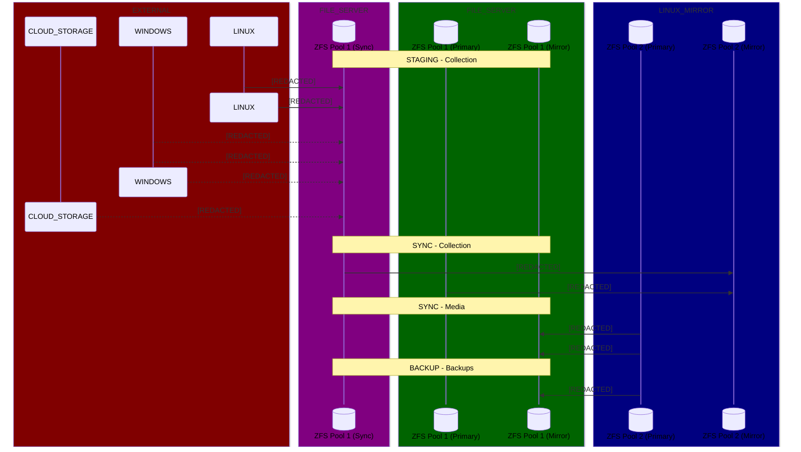

# Synchronization
## Overview

```mermaid
sequenceDiagram
    box Maroon EXTERNAL
        participant CLOUD_STORAGE
        participant WINDOWS
        participant LINUX
    end

    box Purple FILE_SERVER
        participant ZFS_POOL_1_SYNC@{ "type" : "database", "alias": "ZFS Pool 1 (Sync)" }
    end

    box DarkGreen FILE_SERVER
        participant ZFS_POOL_1_PRIMARY@{ "type" : "database", "alias": "ZFS Pool 1 (Primary)" }
        participant ZFS_POOL_1_MIRROR@{ "type" : "database", "alias": "ZFS Pool 1 (Mirror)" }
    end

    box Navy LINUX_MIRROR
        participant ZFS_POOL_2_PRIMARY@{ "type" : "database", "alias": "ZFS Pool 2 (Primary)" }
        participant ZFS_POOL_2_MIRROR@{ "type" : "database", "alias": "ZFS Pool 2 (Mirror)" }
    end

    Note over ZFS_POOL_1_SYNC, ZFS_POOL_1_MIRROR: STAGING - Collection

    LINUX->>ZFS_POOL_1_SYNC: [REDACTED]
    destroy LINUX
    LINUX->>ZFS_POOL_1_SYNC: [REDACTED]

    WINDOWS-->>ZFS_POOL_1_SYNC: [REDACTED]
    WINDOWS-->>ZFS_POOL_1_SYNC: [REDACTED]
    destroy WINDOWS
    WINDOWS-->>ZFS_POOL_1_SYNC: [REDACTED]

    destroy CLOUD_STORAGE
    CLOUD_STORAGE-->>ZFS_POOL_1_SYNC: [REDACTED]

    Note over ZFS_POOL_1_SYNC, ZFS_POOL_1_MIRROR: SYNC - Collection

    ZFS_POOL_1_SYNC->>ZFS_POOL_2_MIRROR: [REDACTED]
    ZFS_POOL_1_PRIMARY->>ZFS_POOL_2_MIRROR: [REDACTED]

    Note over ZFS_POOL_1_SYNC, ZFS_POOL_1_MIRROR: SYNC - Media

    ZFS_POOL_2_PRIMARY->>ZFS_POOL_1_MIRROR: [REDACTED]
    ZFS_POOL_2_PRIMARY->>ZFS_POOL_1_MIRROR: [REDACTED]

    Note over ZFS_POOL_1_SYNC, ZFS_POOL_1_MIRROR: BACKUP - Backups

    ZFS_POOL_2_PRIMARY->>ZFS_POOL_1_MIRROR: [REDACTED]
```
